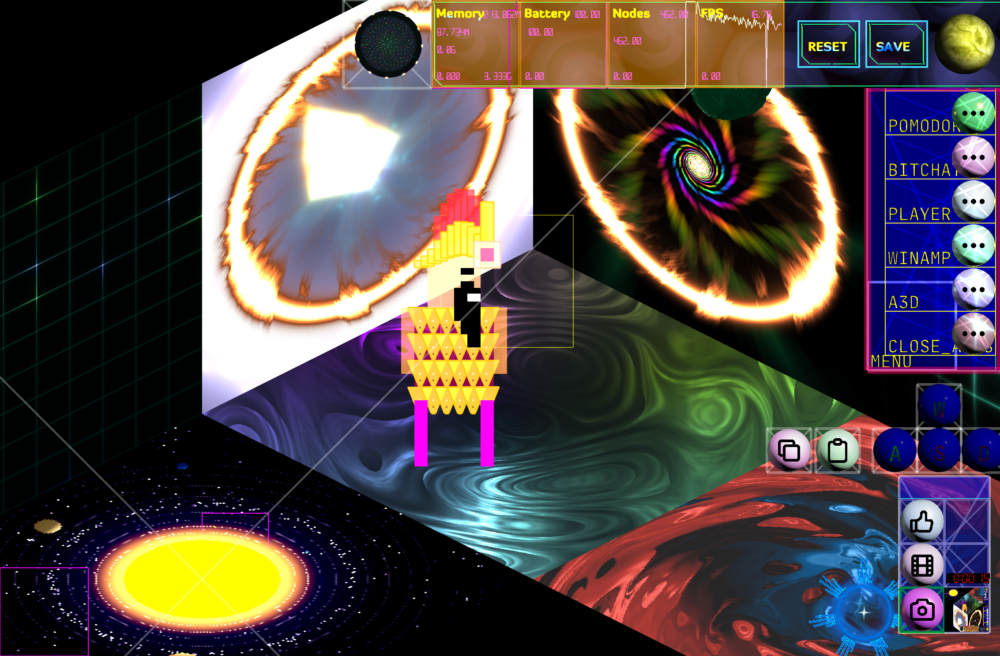

# ada.lovelance game



## Run on device

1. Install AnimationCPU on your iPhone or iPad
2. Run AnimationCPU and tap the yellow **Bootloader** button in the left corner at startup.
3. Insert [ada-lovelance.zip](ada-lovelance.zip) in the url text field
4. Press Connect

## Development

1. Clone the bitchat ACPUL code
```
git clone https://github.com/goldenwebb/ada.lovelance.git
```

2. Install acpu-server
```
https://github.com/goldenwebb/acpu-server
```

3. Run acpu-server
```
cd acpu-server
BASE=ada.lovelance node acpu-server.js
```

4. Run AnimationCPU and tap the yellow **Bootloader** button in the left corner at startup.

5. Enter your acpu-server IP address 
IP: `192.168.0.1` 
Port: `9077`

## TODO
- Add screens
- Update thanks

## License
MIT

## Sponsorship

If you appreciate this project, please star it on GitHub, buy a coffee, support on Patreon, sponsor on GitHub or donate crypto below.

Looking for sponsors to help fund development, hosting and maintenance.

| Asset | Network | Address |
| --- | --- | --- |
| BTC | Bitcoin | `18Bth1u3pSJzPrCf21tx1F6iSzA2fgKdfU` |
| ETH | Ethereum | `0x072c709a8Ad95Fc182e0E2EEF834C3d944122f0b` |
| USDT | Ethereum (ERC-20) | `0x072c709a8Ad95Fc182e0E2EEF834C3d944122f0b` |
| SOL | Solana | `9gLVQr97baX3KrG9DyaUDd5FwXaiLcDuU6CK5RCNMnWu` |
| DOGE | Dogecoin | `DJP8425i4sGT4tSEXwEDRPJb4vJBGroJs6` |
| LTC | Litecoin | `ltc1q69gg9udgqnky60n7mfzfaj0w7lu80ujx6fysly` |
| TRX | Tron | `TLjkoQfnu7aRRbVRkEYN1vZPzW7ntuM4tn` |

## Thanks

## Contact

[victor.space@protonmail.com](mailto:victor.space@protonmail.com)

